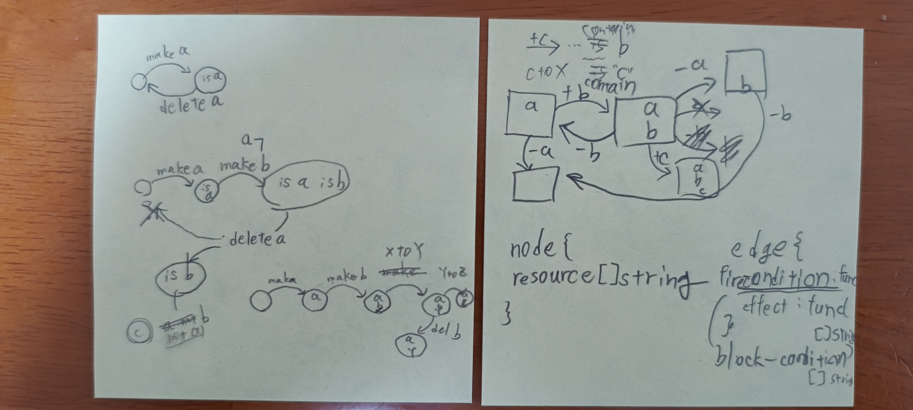

# blindspot - Generate Finite Automaton
ルールに則って状態遷移図を自動生成することで、盲点となっている状態を発見し、遷移ルール作成を手助けする。  
Automatic generation of state transition diagrams according to the rules helps to find blind spot states and create transition rules.
## 目次
- [日本語パート - Japanese](#日本語パート)
- [English - 英語パート](#english)

# 日本語パート
## インストール方法
```sh
$ go install github.com/yuukiiwai/blindspot/cmd/cli/blindspot@latest
```

## 使用方法
1. 状態遷移jsonを作成する
2. コマンドを実行する
    ```sh
    $ blindspot -input data.json -output mermaid
    ```

### 制限モード
⚠️ **重要**: `--limit`を指定しない場合、無限ループが発生する可能性があり、システムに重大な影響を与える危険があります。

無限ループを防ぐため、反復回数の上限を設定することを強く推奨します：
```sh
$ blindspot -input data.json -output mermaid --limit 1000
```

## 便利な使い方
data.jsonのルールを元に書かれた状態遷移図をoutput.svgに記載

### mermaidを末尾に置く
target.mdの末尾にグラフを設置する
```sh
$ echo '```mermaid'; blindspot -input data.json -output mermaid; echo '```' >> target.md
```

### graphvizを使用してsvgを生成する
> [!Info]
> 前提: graphvizがインストールされていること

```sh
$ blindspot -input data.json -output dot | dot -Tsvg -o output.svg
```

## コントリビューター向け
### AI開発者向け設定
このプロジェクトにはCursor IDEとClaude Code用の設定が含まれています:
- `.cursor/rules/`: Cursor IDE用プロジェクト固有ルール
- `CLAUDE.md`: Claude Code用開発ガイダンス

### 解決する課題


# English
## Installation
```sh
$ go install github.com/yuukiiwai/blindspot/cmd/cli/blindspot@latest
```

## Usage
1. make state json
2. execute under command
    ```sh
    $ blindspot -input data.json -output mermaid
    ```

### Limit Mode
⚠️ **Important**: Without specifying `--limit`, infinite loops may occur and pose serious risks to your system.

It is strongly recommended to set an upper limit on iterations to prevent infinite loops:
```sh
$ blindspot -input data.json -output mermaid --limit 1000
```

## Convenient Usage
Generate state transition diagrams based on data.json rules and save to output.svg

### Append mermaid to file
Place graph at the end of target.md
```sh
$ echo '```mermaid'; blindspot -input data.json -output mermaid; echo '```' >> target.md
```

### Generate SVG using graphviz
> [!Info]
> Prerequisite: graphviz must be installed

```sh
$ blindspot -input data.json -output dot | dot -Tsvg -o output.svg
```

## For Contributers
### AI Developer Setup
This project includes configurations for Cursor IDE and Claude Code:
- `.cursor/rules/`: Project-specific rules for Cursor IDE
- `CLAUDE.md`: Development guidance for Claude Code

## What I want to resolve

